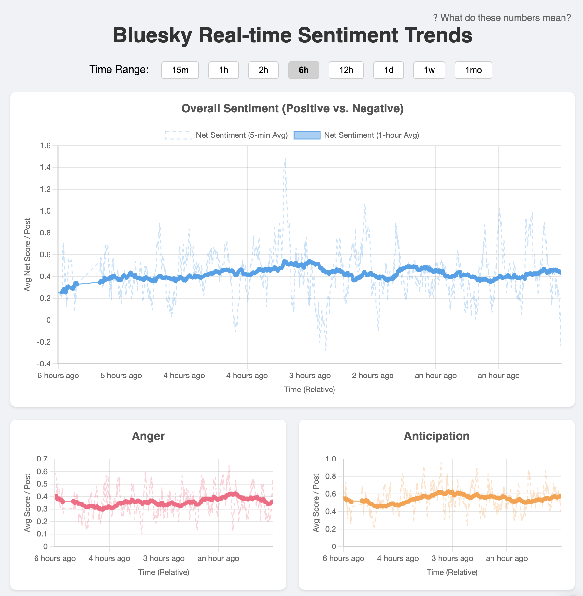

# Bluesky Real-time Sentiment Analysis Dashboard

A real-time dashboard that monitors the Bluesky firehose, performs sentiment analysis on posts using the NRC Emotion Lexicon, aggregates the results, and displays sentiment trends over time.

**Live Demo:** [https://bluesky-sentiment-analysis.fly.dev](https://bluesky-sentiment-analysis.fly.dev)

*(Note: Data persistence is enabled via Fly Postgres. Requires `fly proxy` for local development against the live DB.)*



## Features

*   Connects to the Bluesky Firehose via WebSockets.
*   Filters for English language posts using `franc`.
*   Performs sentiment analysis based on the NRC Emotion Lexicon for 8 core emotions + positive/negative.
*   Aggregates scores into 10-second intervals.
*   Real-time updates pushed to frontend clients via WebSockets (`ws`).
*   Interactive dashboard built with HTML, CSS, and TypeScript (using Chart.js).
*   Displays separate charts for 8 emotions and one combined Net Sentiment (Positive - Negative) chart.
*   Shows both 5-minute and 1-hour moving averages for each metric.
*   Allows selection of different time range views (15m to 1mo).
*   Relative time labels on the x-axis (e.g., "2 hours ago", "Now").
*   Data persistence using Fly Postgres.
*   Deployed on Fly.io using Docker.

## Technology Stack

*   **Backend:** Node.js, TypeScript, `ws` (WebSockets), `pg` (Postgres client)
*   **Frontend:** HTML, CSS, TypeScript, Chart.js, Moment.js
*   **Data:** Bluesky Firehose, NRC Emotion Lexicon
*   **Libraries:** `@atproto/api`, `franc`, `esbuild`
*   **Infrastructure:** Docker, Fly.io (App Hosting + Postgres)

## Local Development Setup

**Prerequisites:**

*   Node.js (Version specified in `Dockerfile`, e.g., 20.x)
*   npm
*   Fly CLI (`flyctl`)
*   Access to the project's Fly.io organization (to run `fly proxy`)
*   NRC Emotion Lexicon file (downloaded and placed as `data/NRC-Emotion-Lexicon-Wordlevel-v0.92.txt`)

**Steps:**

1.  **Clone the repository:**
    ```bash
    git clone <repository-url>
    cd bluesky-sentiment-analysis
    ```
2.  **Install dependencies:**
    ```bash
    npm install
    ```
3.  **Set up Environment Variables:**
    *   Create a `.env` file in the project root.
    *   Obtain the application-specific database credentials (e.g., from the `fly postgres attach` command output or `fly secrets list`).
    *   Add the `DATABASE_URL` to `.env`, pointing to `127.0.0.1:5432` (the proxy):
        ```dotenv
        # .env
        DATABASE_URL=postgres://<USERNAME>:<PASSWORD>@127.0.0.1:5432/<DATABASE_NAME>?sslmode=disable
        ```
        *(Replace placeholders with actual credentials)*
4.  **Start the Fly Proxy:**
    *   In a **separate terminal**, run the proxy command (replace `bluesky-sentiment-db` if your DB app name is different):
        ```bash
        fly proxy 5432 -a bluesky-sentiment-db
        ```
    *   Keep this terminal running.
5.  **Build the code:**
    ```bash
    npm run build
    ```
6.  **Run the server:**
    ```bash
    npm start
    ```
7.  Open your browser to `http://localhost:3000` (or the port configured in `src/server.ts`).

## Deployment

This project is configured for deployment on [Fly.io](https://fly.io/).

*   The `Dockerfile` handles building the application container.
*   The `fly.toml` file contains the deployment configuration.
*   Deployment is typically done via `fly deploy`.
*   Required secrets (`DATABASE_URL`, `PORT`) are set via `fly secrets set`.
*   A Fly Postgres database is expected to be provisioned and attached.
*   Ensure `min_machines_running` is set to `1` in `fly.toml` for continuous operation.

## Contributing & Backlog

Contributions are welcome!
Please see the [backlog.md](backlog.md) file for a list of planned features and tasks.

Feel free to open issues or submit pull requests.
