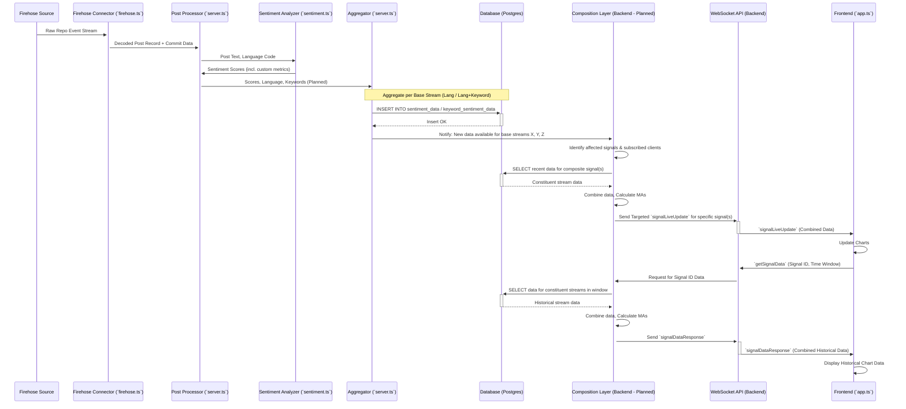

# System Architecture: Bluesky Real-time Sentiment Dashboard

## 1. Introduction

This document outlines the system architecture for the Bluesky Real-time Sentiment Analysis Dashboard. The system connects to the Bluesky Firehose, processes posts for sentiment (based on language and potentially keywords), aggregates this data, stores it, and presents it to users via a real-time web dashboard.

The architecture is evolving from a simple broadcast model to a more sophisticated system supporting globally defined signals (including keyword filters and custom metrics) composed on demand by the backend.

## 2. Core Components

```mermaid
graph LR
    subgraph Frontend
        node_UI[Web UI (HTML/CSS/TS)]
        node_ChartLib[Chart.js]
        node_WSClient[WebSocket Client]
    end
    subgraph Backend [Backend (Node.js/TypeScript)]
        direction TB
        node_HTTPServer[HTTP Server (Static Files)]
        node_WSServer[WebSocket Server (API Layer)]
        subgraph ProcessingPipeline [Processing Pipeline]
            direction LR
            node_FH[Firehose Connector (`firehose.ts`)] --> node_PP[Post Processor (`server.ts#processPost`)]
            node_PP --> node_SA[Sentiment Analyzer (`sentiment.ts`)]
            node_SA --> node_AGG[Aggregator (`server.ts#aggregateAndStore`)]
        end
        subgraph APIComposition [API / Composition (Planned)]
            direction TB
            node_APIHandler[API Handler] --> node_CompLayer[Composition Layer]
            node_CompLayer --> node_DBQuery[DB Query Logic]
        end
        node_WSServer --> node_APIHandler
        node_AGG --> node_DBInsert[DB Insert Logic]
        node_DBQuery --> node_DB[(Database)]
        node_DBInsert --> node_DB
    end
    subgraph ExternalServices [External Services]
        direction TB
        node_Firehose[Bluesky Firehose]
        node_DB[(Database (PostgreSQL))] % Reuse DB ID is fine
    end

    node_Firehose --> node_FH
    node_UI --> node_WSClient
    node_WSClient <-.-> node_WSServer
    node_UI -- HTTP Request --> node_HTTPServer

    classDef backend fill:#f9f,stroke:#333,stroke-width:2px;
    classDef frontend fill:#ccf,stroke:#333,stroke-width:2px;
    classDef external fill:#eee,stroke:#333,stroke-width:2px;
    class Backend,Frontend,ExternalServices external; % Keep top-level subgraph titles
    class node_HTTPServer,node_WSServer,node_FH,node_PP,node_SA,node_AGG,node_APIHandler,node_CompLayer,node_DBQuery,node_DBInsert backend;
    class node_UI,node_ChartLib,node_WSClient frontend;
    class node_Firehose,node_DB external;

```

*   **Bluesky Firehose:** External real-time feed of repository events (posts, likes, etc.).
*   **Backend Application (Node.js/TypeScript):** The core processing engine.
    *   **Firehose Connector (`firehose.ts`):** Connects to the Firehose, decodes messages, extracts post records.
    *   **Post Processor (`server.ts#processPost`):** Receives posts, detects language (`franc`), performs keyword filtering (Planned), calls sentiment analysis.
    *   **Sentiment Analyzer (`sentiment.ts`):** Loads lexicons (Base NRC + Custom [Planned]), analyzes text for sentiment scores.
    *   **Aggregator (`server.ts#aggregateAndStore`):** Collects sentiment scores over intervals (e.g., 10s), aggregates them per base stream (language, language+keyword [Planned]), calculates MAs (incremental for live), and stores results in the DB.
    *   **Database Interface:** Handles connections and queries to the PostgreSQL database.
    *   **WebSocket Server (`ws`):** Manages client connections and handles the API communication.
    *   **API/Composition Layer (Planned):** Handles client requests for specific signals, fetches data for constituent streams, combines data, calculates composite MAs, and sends targeted responses/updates.
    *   **HTTP Server (`http`):** Serves the static frontend files (`index.html`, bundled JS/CSS).
*   **Database (PostgreSQL):** Stores aggregated sentiment data, signal definitions, and custom metrics.
*   **Frontend Application (HTML/CSS/TypeScript):** The user-facing dashboard.
    *   **Web UI (`index.html`, `app.ts`):** Renders charts, handles user interactions (signal selection/definition, time window).
    *   **WebSocket Client:** Connects to the backend WSServer to send requests and receive data.
    *   **Chart.js:** Library used for rendering time-series charts.
    *   **Local Storage (Planned):** Used to persist the user's selected signals across sessions.

## 3. Data Flow



1.  **Ingestion:** The Firehose Connector receives raw events, decodes posts, and passes them to the Post Processor.
2.  **Processing:** The Post Processor detects language. (Planned: It checks against registered keyword filters). It calls the Sentiment Analyzer.
3.  **Analysis:** The Sentiment Analyzer calculates scores using loaded lexicons (base + custom).
4.  **Base Aggregation:** The Aggregator collects scores over time intervals. For each interval:
    *   It aggregates scores per base language stream.
    *   (Planned) It aggregates scores per active `language+keyword` stream.
    *   It stores these aggregated results in the respective DB tables (`sentiment_data`, `keyword_sentiment_data`).
5.  **Live Update Notification (Planned):** The Aggregator notifies the Composition Layer which base streams have new data.
6.  **Live Update Composition (Planned):** The Composition Layer identifies which defined signals depend on the updated base streams and which clients are subscribed to those signals. For each affected client/signal pair, it fetches the necessary recent data for *all* components of the signal, combines them, calculates composite MAs, and sends a targeted `signalLiveUpdate` message via the WebSocket API.
7.  **History Request (Planned):** A client requests data for a specific `signal_id` via `getSignalData`.
8.  **History Composition (Planned):** The Composition Layer looks up the signal definition, fetches historical data for all constituent base streams from the DB, combines the data, calculates composite MAs, and sends the result back as `signalDataResponse`.
9.  **Frontend Display:** The Frontend receives `signalDataResponse` or `signalLiveUpdate` messages containing pre-combined data and simply plots it using Chart.js. It uses Local Storage to remember which signals the user wants to see.

## 4. Database Schema

*   **`sentiment_data`:** Stores aggregated data per base language.
    *   `timestamp` (TIMESTAMPTZ, PK): Interval timestamp.
    *   `language` (VARCHAR, PK): Language code (e.g., 'eng').
    *   `scores` (JSONB): Sentiment scores for the interval (e.g., `{"anger": 10, "positive": 50, ...}`).
    *   `post_count` (INTEGER): Number of posts aggregated in this interval.
    *   *Indexes:* (timestamp, language) PK, timestamp DESC.
*   **`keyword_sentiment_data` (Planned):** Stores aggregated data per specific keyword stream.
    *   `timestamp` (TIMESTAMPTZ, PK): Interval timestamp.
    *   `language` (VARCHAR, PK): Language code.
    *   `keyword` (VARCHAR, PK): The specific keyword for this stream. (Alternatively, `keyword_id` FK).
    *   `scores` (JSONB): Sentiment scores for posts matching this keyword in the interval.
    *   `post_count` (INTEGER): Number of posts matching this keyword in the interval.
    *   *Indexes:* (timestamp, language, keyword) PK, timestamp DESC.
*   **`signal_definitions` (Planned):** Stores the configuration of globally available signals.
    *   `signal_id` (UUID or SERIAL, PK): Unique identifier.
    *   `name` (VARCHAR): User-friendly name (e.g., "ENG Crypto & Economy").
    *   `definition` (JSONB): Describes the components (e.g., `{"components": [{"language": "eng", "keyword": "crypto"}, {"language": "eng", "keyword": "economy"}]}` or `{"components": [{"language": "eng"}]}`).
*   **`custom_metrics` (Planned):** Stores definitions for custom sentiment terms.
    *   `metric_id` (UUID or SERIAL, PK): Unique identifier.
    *   `term` (VARCHAR, UNIQUE): The custom word or phrase.
    *   `scores` (JSONB): The sentiment scores assigned by the AI script (e.g., `{"joy": 0.8, "positive": 0.7}`).
    *   `description` (TEXT, Optional): User-provided description.

## 5. Backend Processing Details

*   **Sentiment Analysis:** `sentiment.ts` loads the base NRC lexicon and (Planned) all entries from the `custom_metrics` table into memory on startup or dynamically. The `analyzeSentiment` function uses this combined lexicon. Stemming is applied based on language.
*   **Keyword Filtering (Planned):** `processPost` will fetch active keywords from `signal_definitions`. For an incoming post, it checks if the text contains any relevant keywords for its language.
*   **Aggregation:** `aggregateAndStore` maintains separate in-memory accumulators for each active base language stream AND each active `language+keyword` stream. Every interval, it writes the accumulated data to the appropriate DB tables.
*   **Composition Layer (Planned):** This is the core logic handling the new API. It needs efficient functions to:
    *   Fetch data for multiple streams concurrently from the DB.
    *   Merge time-series data based on timestamps, summing scores and counts.
    *   Calculate moving averages on the combined data series.

## 6. API Layer (WebSocket)

*   **Current (To Be Replaced):**
    *   `requestHistory`: Client -> Server. Requests bulk history for specified languages.
    *   `historyData`: Server -> Client. Response to `requestHistory` with raw aggregated data per language.
    *   `liveUpdate`: Server -> *All* Clients (Broadcast). Sends newly aggregated data points for all active languages.
*   **Planned (Signal-Based):**
    *   `getAvailableSignals`: Client -> Server. Requests the list of globally defined signals.
    *   `availableSignals`: Server -> Client. Response with list from `signal_definitions`.
    *   `defineSignal` (Optional): Client -> Server. Registers a new signal definition (e.g., combining keywords). Requires careful security/validation.
    *   `getSignalData`: Client -> Server. Requests historical data for a specific `signal_id`.
    *   `signalDataResponse`: Server -> Client. Response with *combined and processed* historical data for the requested `signal_id`.
    *   `subscribeSignal`: Client -> Server. Client indicates interest in live updates for a specific `signal_id`.
    *   `unsubscribeSignal`: Client -> Server. Client indicates end of interest.
    *   `signalLiveUpdate`: Server -> *Subscribed* Client(s). Sends the latest *combined and processed* data point for a specific `signal_id`.

## 7. Frontend

*   **Initialization:** Connects to WebSocket, fetches available signals (`getAvailableSignals`), loads user's tracked signals from Local Storage (Planned), sends `subscribeSignal` for tracked signals, requests initial history (`getSignalData`) for tracked signals.
*   **UI:** Uses Chart.js to render `mainChart` (line plots for signals) and `volumeChart` (stacked bars per language). Provides UI for browsing/selecting available signals, defining new signals (keywords/custom metrics [Planned]), and managing the displayed signals list.
*   **Data Handling:** Receives `signalDataResponse` and `signalLiveUpdate` messages containing pre-combined data. Updates the corresponding datasets in Chart.js directly. No complex client-side merging required.
*   **Persistence (Planned):** Saves the IDs of the signals the user is currently viewing to the browser's Local Storage. On reload, reads these IDs to restore the view.

## 8. Future Considerations

*   **Scalability:** The composition layer needs to be optimized, especially the data fetching and combining steps, if many complex signals or clients are active. Caching strategies might be needed. Aggregating *all* metrics for *all* keyword streams could significantly increase DB load/storage.
*   **Error Handling:** Robust error handling is needed throughout the pipeline (Firehose disconnects, DB errors, processing errors, API errors).
*   **Refactoring:** `server.ts` should be broken down into smaller, more focused modules (e.g., `api.ts`, `composition.ts`, `aggregation.ts`).
*   **Testing:** Comprehensive unit and integration tests are crucial, especially for the composition layer and API.
*   **Security:** If `defineSignal` or custom metric definition is implemented, proper validation and potentially rate limiting are needed. 